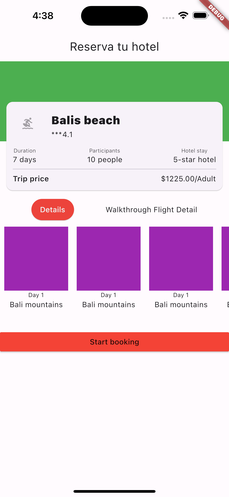
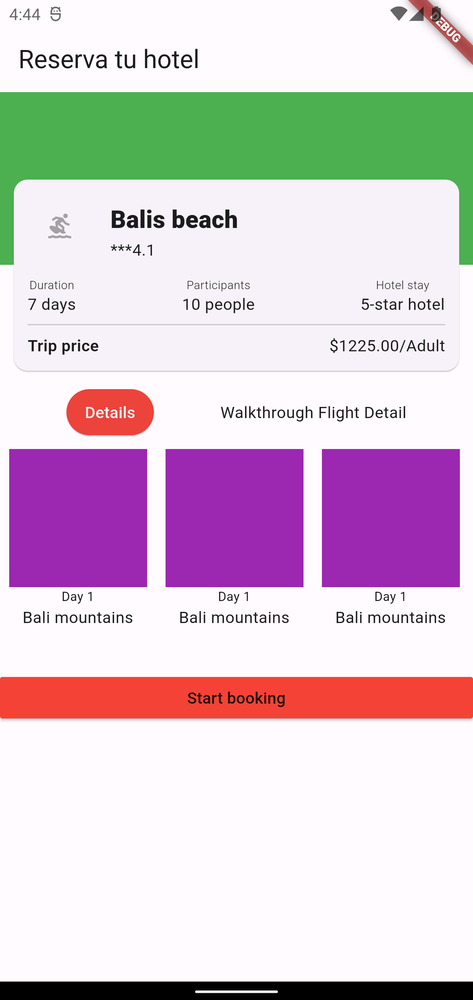

# Tarea 3 base

App para practicar los siguientes temas:
- Filas, Columnas
- Alineacion de elementos
- Imagenes
- Textos y estilos
- Overflow de pixeles*

## Getting Started

Recuerda que despues de clonar el proyecto, abrir una terminal **dentro** de la carpeta del proyecto y ejecutar el comando:

```sh
flutter packages get
``` 

## App Screenshot


